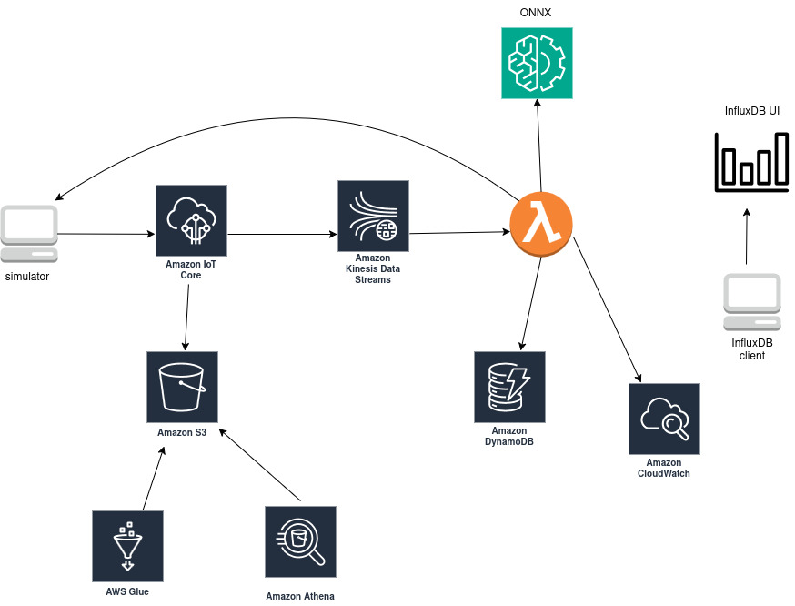
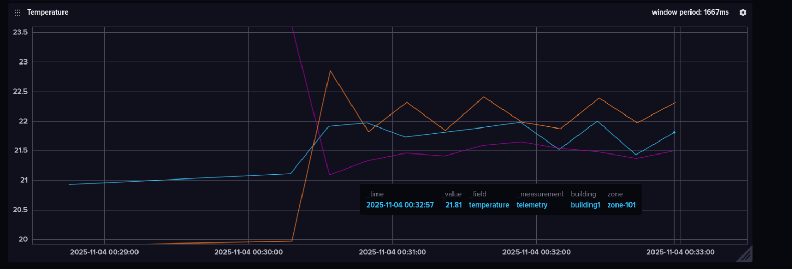
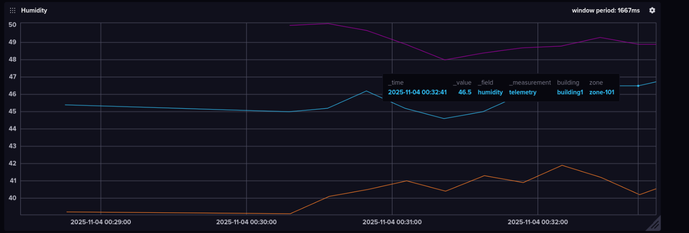

# Smart Building IoT Telemetry Pipeline (AWS + InfluxDB + ONNX)

This project showcases an **IoT telemetry pipeline** for smart building environments, built with **AWS IoT Core**, **Kinesis**, **Lambda**, **DynamoDB**, and **InfluxDB**.
It demonstrates how to collect, process, predict, and visualize sensor data from multiple building zones using an **end-to-end cloud-to-edge architecture**.

---

##  System Overview

###  Data Flow
##### Simulator → AWS IoT Core
The simulator publishes telemetry data (temperature, humidity, occupancy, timestamp) to the MQTT topic:  
building/<building_id>/zone/<zone_id>/telemetry


##### AWS IoT Core → Amazon Kinesis Data Streams
IoT Core rules forward incoming telemetry events to a Kinesis stream for scalable ingestion and buffering.


##### Amazon Kinesis Data Streams → AWS Lambda
Lambda is triggered by Kinesis records, decodes the telemetry payload, and performs inference using the ONNX model to predict `set_temp` and `fan_speed`.  
> **Note:** SageMaker or an ECS container running AI logic could be used, but to keep it simple Lambda is used here.


##### AWS Lambda → Amazon DynamoDB
Lambda stores each telemetry record along with prediction results in DynamoDB for quick querying and real-time analytics.


##### AWS Lambda → Amazon IoT Core (Command Topic)
Lambda publishes control messages (`set_temp`, `fan_speed`) back to IoT Core, where the simulator subscribes to receive them.


##### AWS Lambda → Amazon CloudWatch
Logs and errors from Lambda execution are sent to CloudWatch Logs, where insights can be queried using **CloudWatch Logs Insights**.


##### AWS IoT Core → Amazon S3 (Data Lake)
IoT Core also routes raw telemetry data to S3 for long-term archival and batch analytics.


##### Amazon S3 → AWS Glue → Amazon Athena
Glue crawlers catalog S3 data, and Athena enables SQL-based exploration of historical telemetry.


##### Simulator → InfluxDB Client → InfluxDB UI
The simulator (or a local bridge client) also forwards telemetry to a local InfluxDB instance for real-time visualization via the InfluxDB UI.


---

##  Key Components

| Component | Description |
|------------|--------------|
| **Simulator** | Publishes telemetry data (`temperature`, `humidity`, `occupancy`) to AWS IoT Core MQTT topics like `building/{id}/zone/{id}/telemetry`. |
| **AWS IoT Core** | Central IoT hub that routes telemetry to multiple destinations (S3, Kinesis, Lambda). |
| **AWS Kinesis** | Streams real-time telemetry events for downstream analytics and Lambda processing. |
| **AWS Lambda** |- Hosts the **AI inference logic** using a lightweight **ONNX model** to predict `set_temp` and `fan_speed` values based on incoming telemetry (`temperature`, `humidity`, `occupancy`). - Publishes predicted commands back to IoT Core topics for simulators to consume. - Stores raw and processed telemetry into **DynamoDB** for quick lookups. - **Note:** A more scalable approach could use **Amazon SageMaker** or an **ECS container** running the AI logic, but to keep this example simple, **AWS Lambda** is used here.
 |
| **DynamoDB** | NoSQL database storing structured telemetry and prediction results. |
| **InfluxDB (Local)** | Time-series database for visualizing telemetry trends in real time. |
| **CloudWatch** | Observability layer for monitoring Lambda executions and IoT Core metrics. |
| **S3 + Athena + Glue** | Data lake and query layer for long-term telemetry analysis. |

---

##  AWS Architecture Diagram





---

##  Data Model Example

### Telemetry Message

```json
{
  "building": "building1",
  "zone": "zone-103",
  "temperature": 22.5,
  "humidity": 45.1,
  "occupancy": 1,
  "ts": 1762179569
}
```

### Predicted command 

```json
{
  "building": "building1",
  "zone": "zone-103",
  "set_temp": 21.5,
  "fan_speed": 3
}


```


##  Visualization & Analytics

###  Real-Time

- **InfluxDB UI** – Used locally to visualize telemetry streams such as **temperature**, **humidity**, and **occupancy**.




---

### Historical

- **Amazon S3 (Data Lake)** – Stores raw telemetry JSON files streamed from IoT Core.
- **Amazon Athena + AWS Glue** – Enables SQL-based querying and aggregation over historical telemetry data for analytics and reporting.
- **Amazon CloudWatch Logs Insights** – Analyze Lambda execution logs, detect anomalies, and troubleshoot issues using queries such as:

  ```sql
  fields @timestamp, @message
  | filter @message like /ERROR/
  | sort @timestamp desc
  | limit 20
